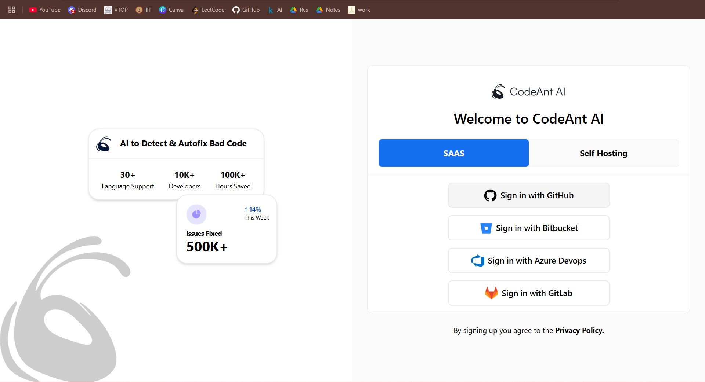
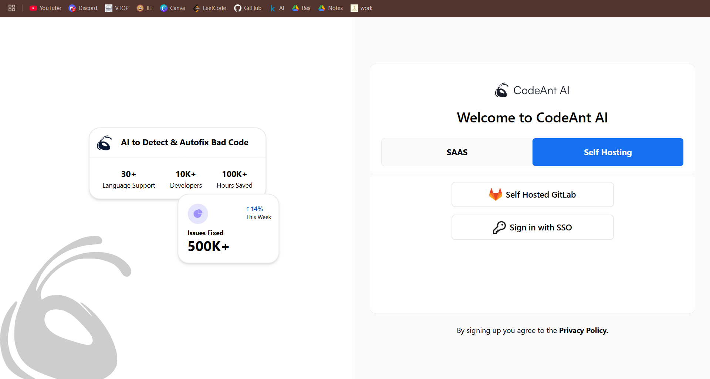
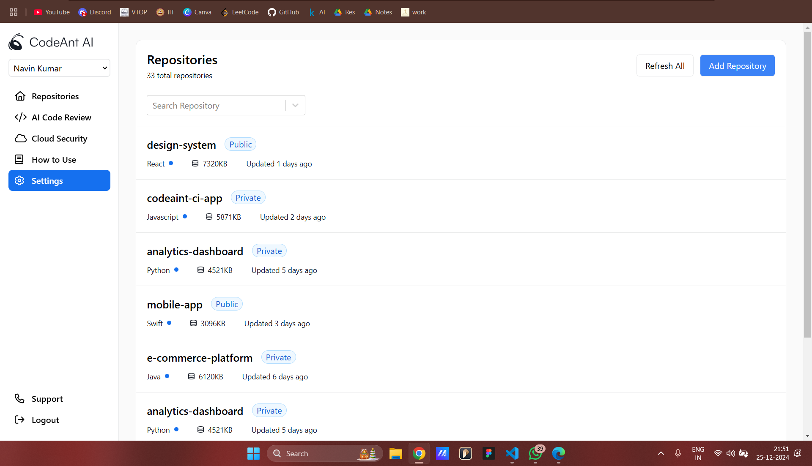
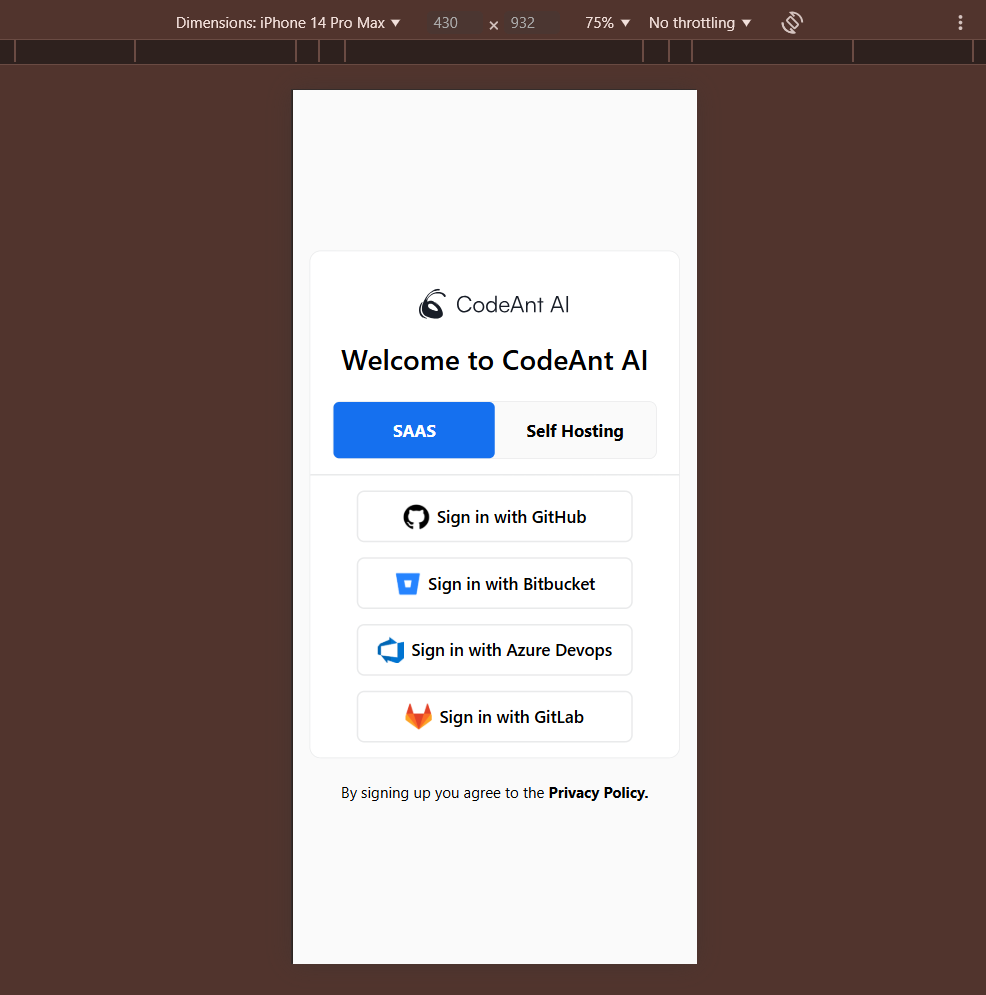
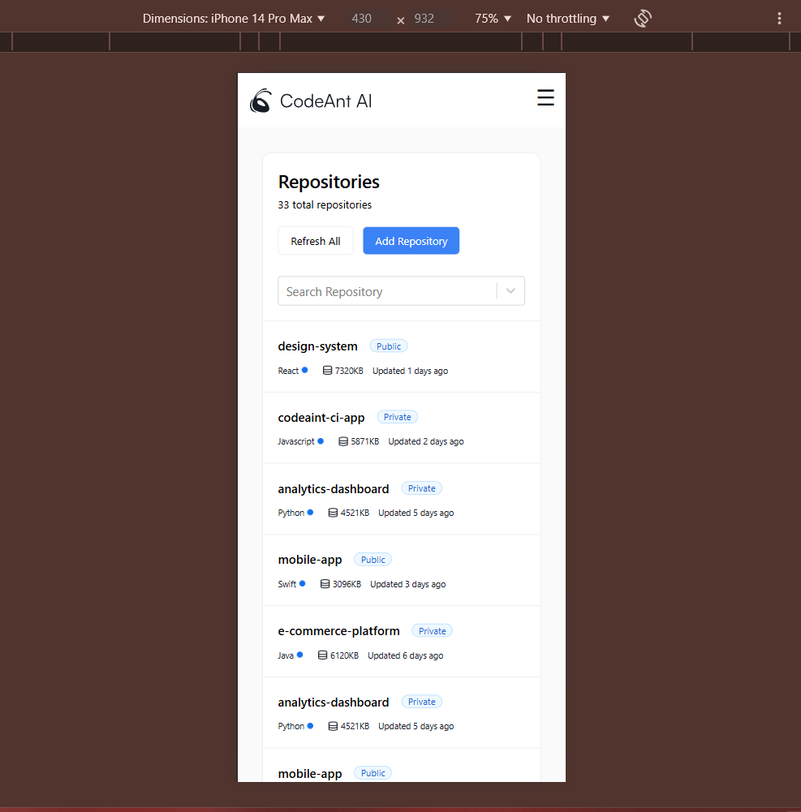
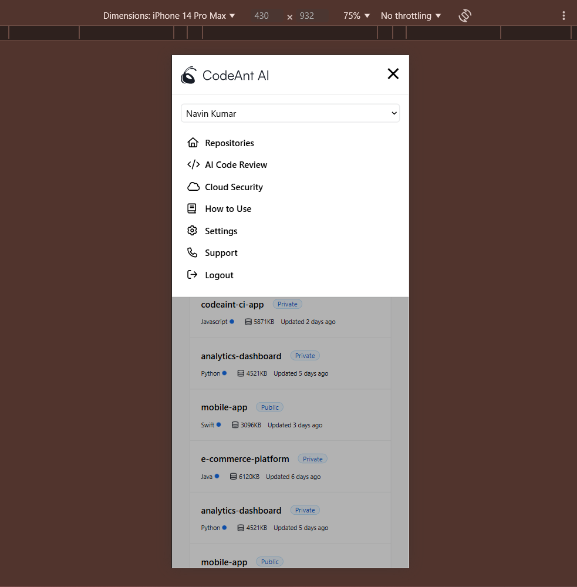

<h1>CodeAnt AI FrontEnd Assignment</h1>

This project is a modern frontend application built with ReactJS, using Vite for fast and efficient development, and TailwindCSS for  sleek and customizable styling. The combination of these tools ensures 
  a high-performance, scalable, and visually appealing application.

<h2>Desktop ScreenShot</h2>

<h2>Mobile ScreenShot</h2>

